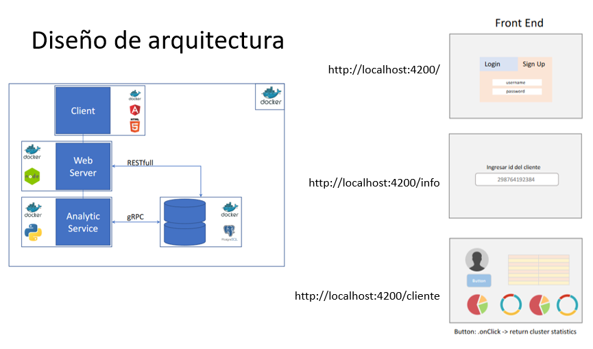

# Proyecto de analitica

El siguiente proyecto fullstack, brinda a traves de un servicio de 
analisis, informacion de clientes.

Caracteristicas:
	-Uso de contenedores docker.
	-Framework angular
	-Proteccion de rutas
	-ngx-cookie-service
	-JTW
	-Bootstrap
	-Node JS
	-Mongo DB
	-Python
	-K-Means model
	-Diseño web responsivo

## Instrucciones

1. Clonar proyecto.

2. dentro de la carpeta system ejecutar:

docker-compose build
docker-compose up     "o"    docker-compose up -d

3. Ir al explorador en la siguiente direccion:

http://localhost:4200/

enjoy!

### Detener contenedor:

docker-compose  stop

docker  stop $(docker ps -a -q)

### mostrar informacion de contenedores. :

docker ps -a

## Sistema

Angular CLI: 13.3.5
Node: 14.18.1
Package Manager: npm 6.14.15
OS: win32 x64

## Diseno de arquitectura.

